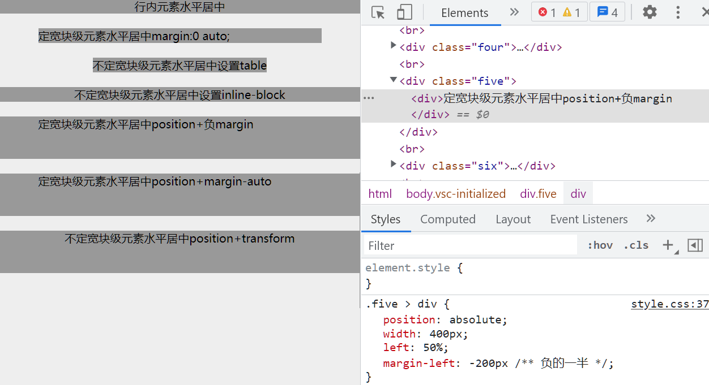

# horizontal-center 水平居中的多种 css 实现

## 概述

水平居中是非常基础的布局，除了统一用 flex 布局，还有很多可以方便实现。

## 运行

直接浏览器查看 html 即可

## 分析

分为：

- 定宽
- 不定宽

## 推荐

### 定宽

- margin:auto ::star:
- position+margin:auto
- position+margin:负一半

### 不定宽

- inline::star:
- inline-box
- table
- position+transform50%

## 总结

熟练运用多种布局方式，可以根据情况挑选方便的使用。当然，复杂情况用 flex 和 grid 比较好。

## Reference

1. [CSS-水平居中、垂直居中、水平垂直居中 - SegmentFault 思否](https://segmentfault.com/a/1190000014116655)
